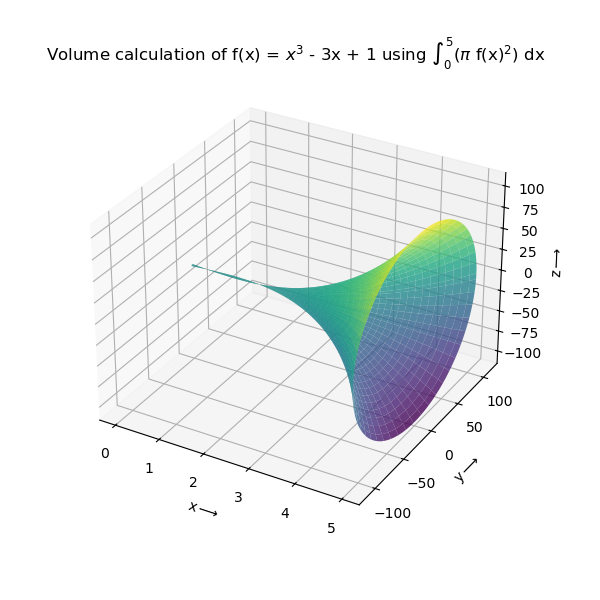

# 3D Volume Calculation

A Python-based mathematical tool for calculating and visualizing the volume of solids of revolution. This project computes the volume of a 3D solid generated by rotating a mathematical function around an axis using calculus integration, and provides an interactive 3D visualization of the resulting solid.

## Description

This project demonstrates the practical application of calculus in computing volumes of solids of revolution. It uses the disk method to calculate the volume when the function **f(x) = x³ - 3x + 1** is rotated around the x-axis over the interval [0, 5].

The volume is calculated using the formula:

```
V = π ∫[0,5] f(x)² dx
```

The script not only computes the numerical volume but also generates a stunning 3D visualization of the solid using surface plotting.

## Features

- **Mathematical Volume Calculation**: Uses symbolic mathematics (SymPy) to compute the exact volume integral
- **3D Visualization**: Creates an interactive 3D surface plot of the solid of revolution
- **Parametric Surface Generation**: Generates mesh grids using polar coordinates for accurate surface representation
- **Customizable Function**: Easy to modify the function and integration bounds for different calculations
- **Visual Output**: Produces high-quality visualizations with labeled axes and descriptive titles

## Installation

### Prerequisites

- Python 3.6 or higher
- pip (Python package manager)

### Setup

1. Clone the repository:
```bash
git clone https://github.com/0PKunal/3d-Volume-Calculation.git
cd 3d-Volume-Calculation
```

2. Install required dependencies:
```bash
pip install numpy matplotlib sympy
```

Alternatively, you can install dependencies using:
```bash
pip install -r requirements.txt
```
*(Note: Create a requirements.txt file with the packages listed below if needed)*

## Requirements

The project requires the following Python packages:

- **numpy**: For numerical computations and array operations
- **matplotlib**: For creating 3D plots and visualizations
- **sympy**: For symbolic mathematics and integration

## Usage

Run the script using Python:

```bash
python 3d_Volume_Calculation.py
```

### Output

The script will:
1. Calculate and print the volume of the solid to the console
2. Display an interactive 3D plot showing the solid of revolution

Example output:
```
Volume: 16336.2811529082 cubic unit
```

The visualization shows the solid generated by rotating f(x) = x³ - 3x + 1 around the x-axis.



### Customization

To calculate volumes for different functions:

1. Open `3d_Volume_Calculation.py`
2. Modify the function definition:
```python
f = x**3 - 3*x + 1  # Change this to your desired function
```
3. Update the integration bounds:
```python
integral = integrate(f**2, (x, 0, 5))  # Change (0, 5) to your bounds
```
4. Update the plotting range accordingly

## Mathematical Background

The volume of a solid of revolution is calculated using the disk method. When a continuous function f(x) is rotated around the x-axis from x = a to x = b, the volume is:

**V = π ∫[a,b] [f(x)]² dx**

This project implements this formula using symbolic integration for exact results, then creates a parametric surface using:
- **x-coordinate**: Linear spacing along the interval
- **y-coordinate**: Function values at each x
- **z-coordinate**: y × cos(θ) for rotation
- **w-coordinate**: y × sin(θ) for rotation

Where θ ranges from 0 to 2π to complete the revolution.

## License

This project is licensed under the MIT License. See the [LICENSE](LICENSE) file for details.

## Contributing

Contributions are welcome! Feel free to:
- Report bugs or issues
- Suggest new features or improvements
- Submit pull requests

Please ensure any code contributions maintain the existing style and include appropriate documentation.

## Author

Created by [0PKunal](https://github.com/0PKunal)

---

<div align="center">
  <p>Made with ❤️ by <a href="https://github.com/0PKunal">0PKunal</a></p>
  <p>If this project helped you, please give it a ⭐️</p>
</div>
